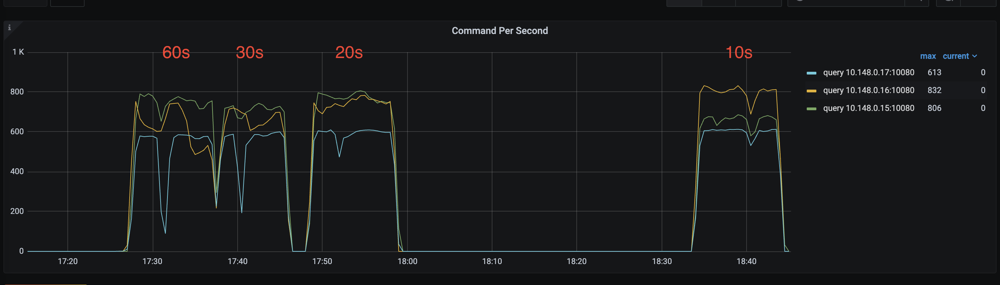

# tidb-stale-read-demo
Demo for TiDB stale-read behavior across a 3-AZ cluster.

## Prerequisites
- TiUP  (install via `curl --proto '=https' --tlsv1.2 -sSf https://tiup-mirrors.pingcap.com/install.sh | sh`)
- MySQL client (`mysql`)
- Go (>=1.16)

## Deploy 3-AZ TiDB Cluster
Run the deploy script to destroy any existing cluster, deploy a new 3-AZ cluster with labeled TiKV/TiDB nodes, start it, and set replica-read policy:
```bash
chmod +x deploy_3az_tidb.sh
./deploy_3az_tidb.sh
```

By default, this connects to 10.148.0.15:4000 as root and issues:
```sql
SET GLOBAL tidb_replica_read = 'closest-replicas';
```

## Simulate AZ3 Isolation
On the AZ3 node (`10.148.0.16`), use the iptables script to block or unblock all traffic to/from AZ1/AZ2:
```bash
# block AZ3 -> {AZ1, AZ2}
sudo chmod +x isolate_az3_iptables.sh
sudo ./isolate_az3_iptables.sh block

# restore connectivity
sudo ./isolate_az3_iptables.sh unblock
```

## Run Read-Only Benchmark
Use the Go program to drive a fixed, sequential read workload against all TiDB replicas for 10 minutes:
```bash
go run main.go -staleness=<seconds>
```
- `-staleness=0` (default) reads at leader
- `-staleness=-600` reads at closest replica, allowing up to 10 minutes of staleness

Check TPS and total operations in the log output.

## Conclusion

1. TiDB v8.5.1 has a known issue and requires the client-go patch from [PR #1583](https://github.com/tikv/client-go/pull/1583) to work correctly.
2. There is a hard-coded 99s timeout in client-go (see [kv.go#L182](https://github.com/tikv/client-go/blob/e84f1a780fa63c25b76b8813eee4d587904b8221/tikv/kv.go#L182)), so network isolations longer than this will cause unavoidable errors.
3. In practice, a 10s network isolation shows no impact on services; a 60s isolation causes a drop in QPS and higher latency, but does not trigger errors.

## Test Results

The following picture shows the test results when a network block is injected on 10.148.0.17 for different durations with `-staleness=-600`:


